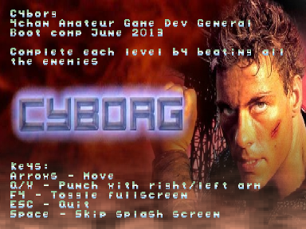

Cyborg
======

Cyborg AGDG code v1.1.0

Congratulations to Ingemar to be the first person to beat the game!



Info
====
Game for the 4chan /agdg/ (Amateur Game Development General) June 2013 challange: "Games based on movies with IMDB ratings below 5.0".

Windows 32bit download: [Download](http://martus.se/files/cyborg-win32-1.1.zip).
IMDB Cyborg movie link: [IMDB](http://www.imdb.com/title/tt0097138/).

Compile Win32
=============
To compile the windows version you must [download this zip](http://martus.se/files/cyborg_win32_dependencies.zip) file and unzip it in the root directory.
Then run ```make win32```.

